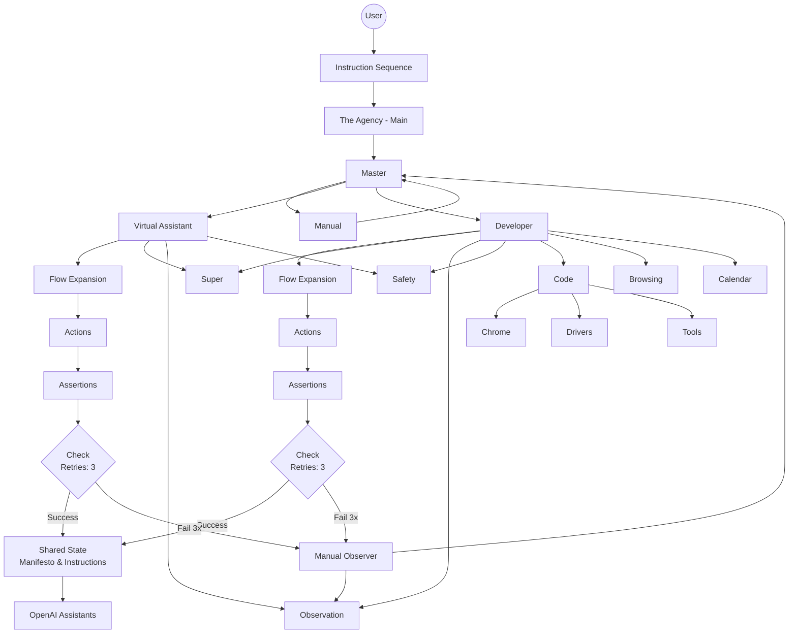

# 🧠 Multi-Agent Master-Led Testing Platform

### *Automated Flow Execution · Intelligent Validation · Human-Fallback Assurance*

This platform creates a **multi-agent testing swarm** orchestrated by a central **Master Agent**.
It is designed to execute **instruction sequences**, expand them into actionable flows, perform automated validations, and escalate to human review if needed.

The system ensures **high-confidence testing**, predictable automation, and safe fallback behavior through structured agent collaboration.

---

## 🌐 High-Level Architecture Overview

### 1. **User Input**

The user provides a **Sequence of Instructions** containing:

* Steps to execute
* Expected behavior
* Assertions
* Required tools or environments

These instructions enter the platform through **The Agency – Main**, which distributes tasks downward.

---

## 👑 Master Agent

The **Master Agent** controls and coordinates the entire multi-agent swarm.

### Responsibilities

* Receives and interprets instruction sequences
* Delegates tasks to specialized agents
* Ensures safety, consistency, and correctness
* Triggers retries and manual escalation when needed

---

## 🤖 Delegated Agents

### 🌟 Virtual Assistant (VA)

Focuses on:

* High-level workflow expansion
* Task breakdown
* Environmental setup
* Communication, lightweight operations

### 👨‍💻 Developer Agent (Dev)

Handles:

* Technical flow execution
* Code-related operations
* Browser automation
* Tool-driven interactions (Chrome, Drivers, Tools)

Both agents interact with support modules like:

* 🧩 **Super Memory** – shared long-term context
* 👁 **Observation Logger** – captures everything for audit/replay
* 🔐 **Safety Layer** – enforces boundaries/safe operation

---

## 🔄 Flow → Actions → Assertions Pipeline

Regardless of which agent receives the task, the testing pipeline follows the same structure:

### 1. **Flow Expansion**

The agent converts the raw instruction sequence into a clear, step-by-step execution plan.

### 2. **Action Execution**

Each step triggers actual operations using tools such as:

* Code Interpreter
* Browsing Tool
* Calendar
* Chrome / Drivers / Utilities

### 3. **Assertions**

After each action, the system evaluates expected vs. actual behavior.

---

## ❗ Automated Validation + Retry Logic

Every execution path passes through a **Validation Check** block:

* Maximum **3 retries**
* Progressive error recovery
* Failure after 3 attempts routes to **Manual Observer**

This ensures:

* No infinite loops
* Reliable fallback
* Human safety net

---

## 🙋 Manual Observer (Human Takeover)

If automated agents cannot complete the flow successfully, the system triggers:

> **Manual Observer → Human Review**

The observer:

* Inspects logs, memory, and execution traces
* Provides corrections
* Sends findings back to Master, Dev, or VA for reprocessing

---

## 📦 Shared State + OpenAI Assistants

Validated flows, instructions, and outcomes are passed into:

### 🗄 **Shared State / Manifesto**

Provides:

* Consolidated view of all instructions
* Agent alignment
* Consistent memory across runs

The output is then used by:

### 🔮 **OpenAI Assistants API**

for:

* Semantic reasoning
* Contextual expansion
* Cross-agent synchronization

---

## 🗺 Diagram (Mermaid)

> Matches your architecture exactly with flow, actions, assertions, and retry logic.

---

## ✔ Key Guarantees of the System

### **1. Multi-Agent Parallel Intelligence**

Agents perform tasks independently but coordinate through shared state.

### **2. Automated Execution with Built-In Recovery**

Every failed action is retried up to 3 times before involving a human.

### **3. Safety-Driven Orchestration**

All flows pass through safety filters, memory consistency, and observation logs.

### **4. Human-Centered Fallback**

The platform never blocks — manual takeover ensures continuity.

